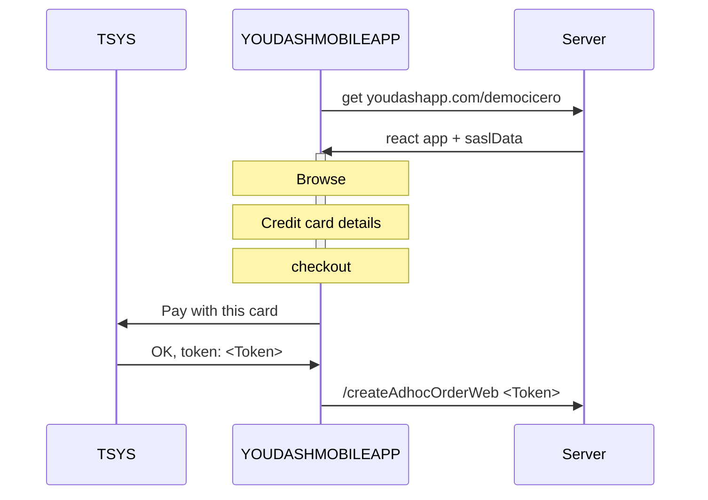

# TSYS_ECOMMERCE

```mermaid
sequenceDiagram
  participant gwy as TSYS
  participant cli as YOUDASHMOBILEAPP
  participant srv as Server

  cli ->> srv: get youdashapp.com/democicero
  srv ->> cli: react app + saslData
  
  activate cli
  Note over cli: Browse

  Note over cli: Credit card details
  Note over cli: checkout
  deactivate cli
  cli ->> gwy: Pay with this card
  gwy ->> cli: OK, token: <Token>
  cli ->> srv:  /createAdhocOrderWeb  <Token>
  
 
  
```
