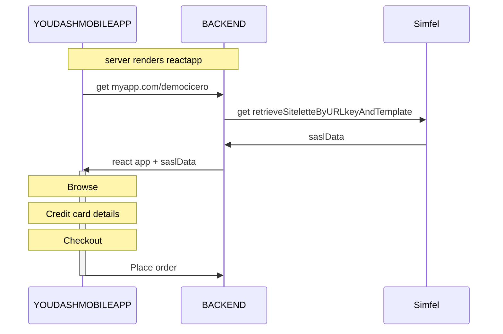

# VANTIV UI FLOW

```mermaid
sequenceDiagram
  participant cli as YOUDASHMOBILEAPP
  participant srv as BACKEND
  participant data as Simfel

  Note over cli,srv: server renders reactapp

  cli ->> srv: get myapp.com/democicero
  srv ->> data: get retrieveSiteletteByURLkeyAndTemplate
  data ->> srv: saslData
  srv ->> cli: react app + saslData
  
  activate cli
  Note over cli: Browse
  Note over cli: Credit card details
  Note over cli: Checkout
  cli ->> srv: Place order
  deactivate cli

  
```
